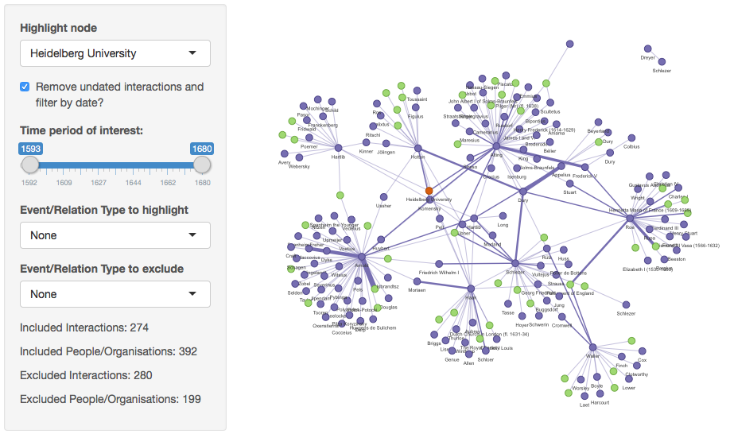

# Cultures of Knowledge

This Live Data&nbsp;case study is the result of a collaboration between the Live Data project team and <a href="http://www.culturesofknowledge.org/">Cultures of Knowledge</a> to visualise a subset of 1695 individuals correspondences from the <a href="http://emlo.bodleian.ox.ac.uk/">Early Modern Letters Online</a> (EMLO) repository.

The visualisations were built by Martin Hadley, data scientist in the <a href="http://blogs.it.ox.ac.uk/acit-rs-team">Academic IT Research Support team</a>, using <a href="http://shiny.rstudio.com/">Shiny</a>, RStudio’s interactive web application framework based on the programming language R. The visualizations were designed by the <a href="http://www.culturesofknowledge.org/">‘Cultures of Knowledge’</a> Project Director Howard Hotson, Digital Project Manager Arno Bosse and Postdoctoral Research Fellow Robin Buning.

Should you have questions about the project or wish to find out more about this dataset, please contact Arno Bosse (http://www.culturesofknowledge.org/?page_id=5).

# Attribution

Code is made available subject to a MIT license, the following copyright and attribution should be respected when reusing the code

- Copyright Owner: University of Oxford
- Date of Authorship: 2016
- Developer: Martin John Hadley (orcid.org/0000-0002-3039-6849)
- Academic Contact: Arno Bosse (http://orcid.org/0000-0003-3681-1289)
